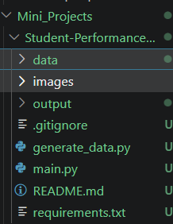
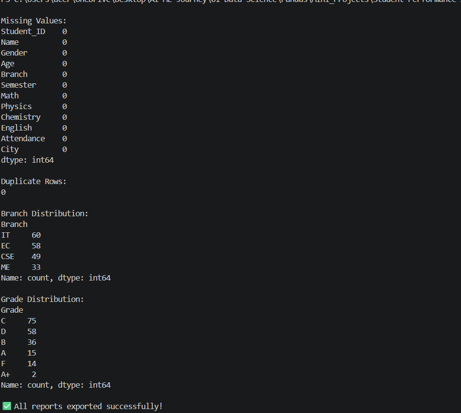
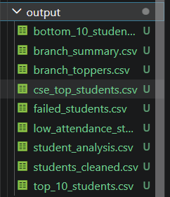

# 📊 Student Performance Analysis using Pandas


## 📖 Project Overview

This project demonstrates how to perform data analysis using the Pandas library in Python. It covers the complete workflow of loading a dataset, cleaning data, performing feature engineering, filtering and sorting records, analyzing data using GroupBy operations, generating descriptive statistics, and exporting analysis reports as CSV files.

The dataset used in this project is synthetically generated using the Faker library, making the project fully reproducible without relying on external datasets.

## ✨ Features

- Load student data from CSV files
- Clean and preprocess the dataset
- Handle missing values and duplicate records
- Create new calculated columns
- Assign grades and pass/fail results
- Filter students based on different conditions
- Sort records by marks and attendance
- Perform GroupBy analysis
- Generate descriptive statistics
- Export multiple analysis reports as CSV files

## 📁 Project Structure


```text
Student-Performance-Analysis/
│
├── data/
│   └── students.csv
│
├── output/
│   ├── student_analysis.csv
│   ├── students_cleaned.csv
│   ├── top_10_students.csv
│   ├── bottom_10_students.csv
│   ├── failed_students.csv
│   ├── low_attendance_students.csv
│   ├── cse_top_students.csv
│   ├── branch_summary.csv
│   └── branch_toppers.csv
│
├── generate_data.py
├── main.py
├── requirements.txt
├── .gitignore
└── README.md
```

## 🛠️ Technologies Used

- Python 3.11
- Pandas
- Faker
- CSV Files
- Visual Studio Code

## 📚 Concepts Covered

### Data Loading
- Reading CSV files using Pandas

### Data Cleaning
- Checking missing values
- Removing duplicate records

### Feature Engineering
- Total Marks
- Average Marks
- Percentage Calculation
- Grade Assignment
- Pass/Fail Prediction

### Data Filtering
- Branch-wise filtering
- Top students
- Failed students
- Low attendance students

### Data Sorting
- Highest Percentage
- Lowest Percentage
- Attendance Sorting

### GroupBy Analysis
- Average Percentage by Branch
- Average Attendance by Branch
- Student Count by Branch
- Branch Summary using `agg()`
- Branch-wise Toppers using `idxmax()`

### Statistics
- describe()
- mean()
- median()
- mode()
- standard deviation
- variance
- correlation
- value_counts()

### Exporting Reports
- Export processed datasets to CSV

## ▶️ How to Run

1. Clone the repository

```bash
git clone <your-github-repository-url>
```

2. Navigate to the project folder

```bash
cd Student-Performance-Analysis
```

3. Install the required packages

```bash
pip install -r requirements.txt
```

4. Generate the dataset

```bash
python generate_data.py
```

5. Run the analysis

```bash
python main.py
```

### Program Output



## 📂 Output Files



The project automatically generates the following reports inside the **output/** folder:

- students_cleaned.csv
- student_analysis.csv
- top_10_students.csv
- bottom_10_students.csv
- failed_students.csv
- low_attendance_students.csv
- cse_top_students.csv
- branch_summary.csv
- branch_toppers.csv

## 🎯 Learning Outcomes

By completing this project, I learned how to:

- Read and write CSV files using Pandas
- Clean and preprocess datasets
- Perform feature engineering
- Apply custom functions using `apply()`
- Filter and sort data efficiently
- Analyze grouped data using `groupby()`
- Calculate descriptive statistics
- Export processed datasets and reports
- Organize Python code using functions
- Build a structured data analysis project

## 🚀 Future Improvements

- Add data visualization using Matplotlib and Seaborn
- Build an interactive dashboard
- Add command-line arguments
- Support Excel file export
- Analyze larger datasets

## 👨‍💻 Author

**Sumit Tiwari**

- B.Tech Computer Science Engineering
- AI & Machine Learning Learner
- Passionate about Data Science, Python, MERN Stack, and Problem Solving